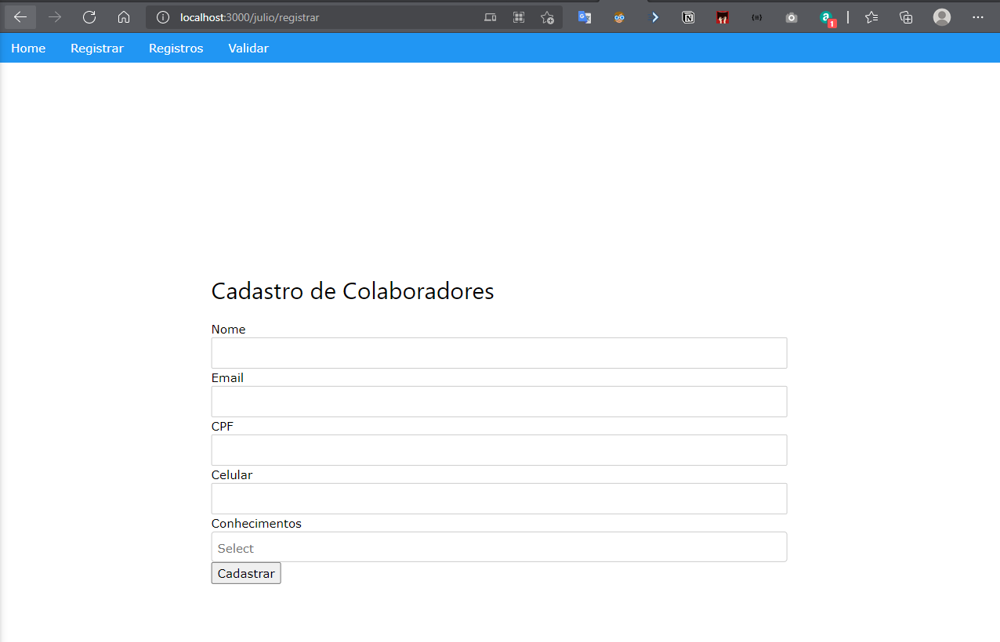
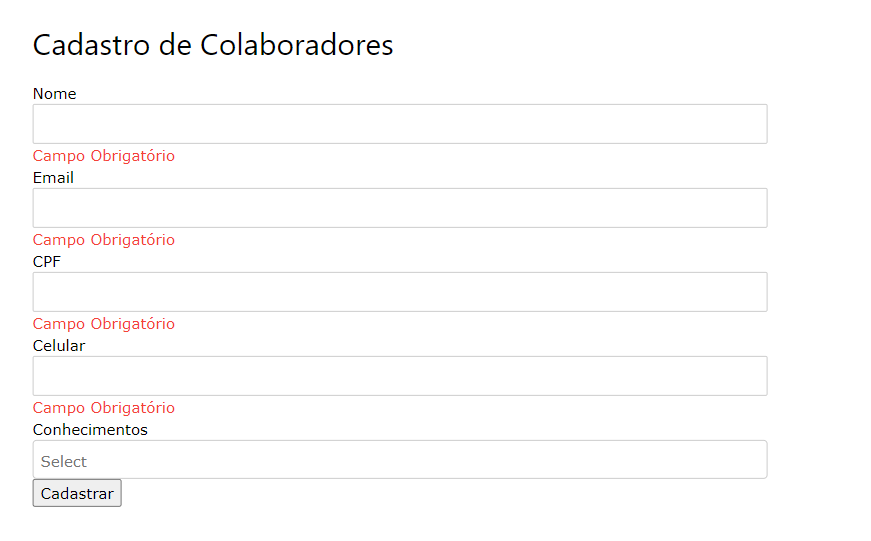
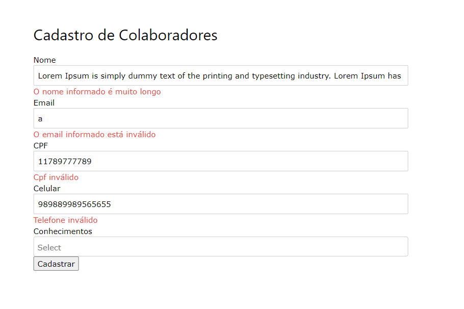
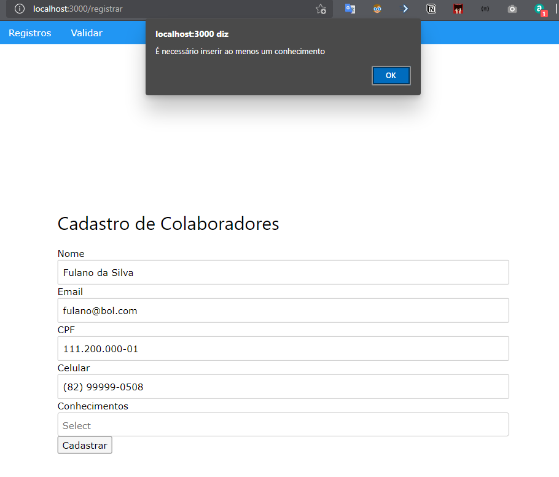
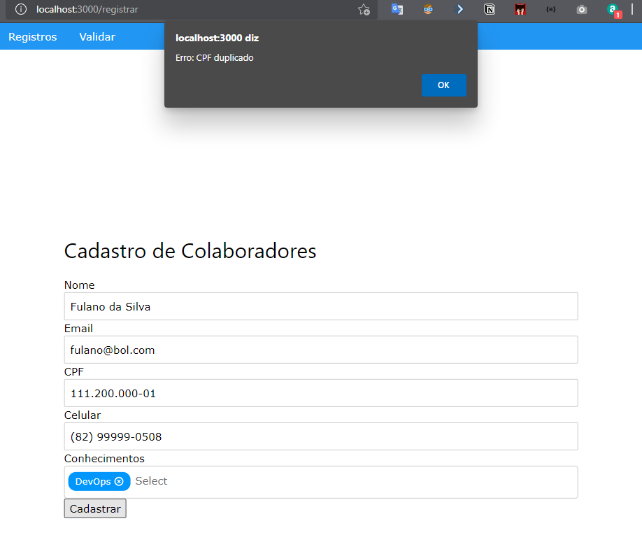
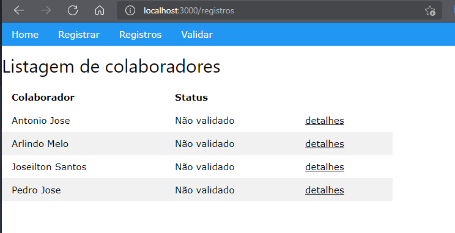

# Manga Rosa Frontend

## Setup da aplicação

> Recomenda-se o uso do gerenciador de pacotes yarn

### `yarn`
Instala todos os pacotes necessários

### `yarn start`

Executa a aplicação no mode dev
Abra o link [http://localhost:3000](http://localhost:3000) para visualizar no navegador.

### Especificações

#### `http://localhost:3000/{NOMEDOCOLABORADOR}/registrar`

Direciona para o formulário de cadastro

    

#### Validações durante o cadastro

    

    

    

    

#### `http://localhost:3000/registros`

Listagem de registros

    

